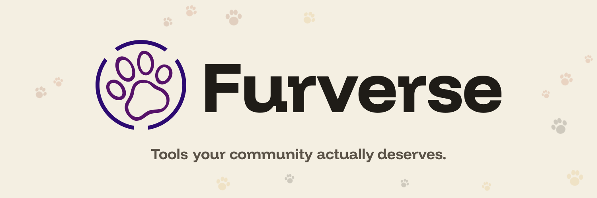
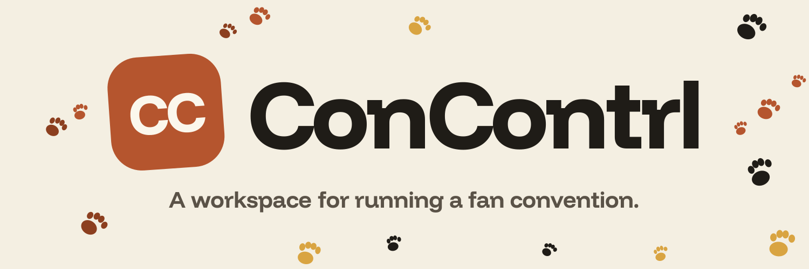

# 🐾 Welcome to the Furverse!
We're building the tools that your community actually deserves. We are a small (<10 person) team, working on tools geared towards the furry community! View some of our projects below and always feel free to provide feedback on anything open source.

For closed source feedback, please join our [Discord Server](https://discord.gg/AeJHZ9Dfcr) and report your feedback there. Our server is also community-focused! Feel free to share some of your creations and even conventions that you run using our software! We'd love to see it and even have the opportunity to show up!

# Projects
Currently, we're focusing all of our work on one special software:

Everyone deserves an easy-to-use workspace for starting and operating a convention, no matter if it's a 50 person event or a 2000 person event. Manage tickets, attendees, vendors and more through one central platform with an easy-to-understand cost and fast-track setup. Need help with getting started? Our dev team will be more than happy to help and get you on the ground, running.

# Social Links
Want to be a part of the action, provide feedback, look at teasers and be first of the bunch to get early-access to our software? There's no cost associated with early-access and later down the road, we may even send a gift or something special as a thank you for your support, as any feedback, negative or positive, is what helps software thrive.

🎮 [Discord Server](https://discord.gg/AeJHZ9Dfcr)

🦋 [Bluesky for ConContrl](https://bsky.app/profile/concontrl.app) \
🦋 [Bluesky for Furverse](https://bsky.app/profile/furverse.io)

🐦‍⬛ [Twitter for ConContrl](https://x.com/concontrl) \
🐦‍⬛ [Twitter for Furverse](https://x.com/thefurverse)

----

Questions about what we do? Want to join us in what we do? \
Feel free to shoot us an email @ contact@furverse.io! We'll reply as soon as possible.

*As with any other "sane" and "woke" company/business/project/team, we care for those with accessibility needs and believe not only that **Trans Rights are Human Rights** but that **everyone** deserves to have human rights. We do not allow any \*phobic content to be hosted on any of our platforms/applications/software and ask that you, the community, report any content found ASAP to security@furverse.io. If you are in need of accessiblity related assistance or would like to provide accessiblity related feedback, please reach out to us at dacompliance@furverse.io and we'll do our damn best to reply back as quick as possible. Much love to you all. 💖*

